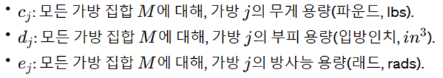

# Google-OR-Tools 
## Solving the Multiple Knapsack Problem with Google OR tools

[Solving the Multiple Knapsack Problem with Google OR tools | by Benjamin McCloskey | Towards Data Science](https://towardsdatascience.com/solving-the-multiple-knapsack-problem-with-google-or-tools-e961dfc8288e)
 

**Introduction**

배낭 문제는 다양한 무게의 아이템을 최적으로 배치하여 배낭을 싸는 방법을 배우기 위해 선형 프로그래밍에서 사용하는 교육용 문제입니다. 각 아이템은 보통 관련 가치도 가지고 있습니다. 목표는 배낭의 가치를 최적화하면서도 가방의 무게 제한을 초과하지 않는 것입니다. 오늘의 문제는 기본 배낭 문제에서 확장되어 여러 제약 조건이 있는 다중 배낭 문제입니다. 제공되는 코드와 접근 방식은 Google OR Tools에서 찾을 수 있는 것과 유사하지만, 오늘 해결해야 할 문제는 더 많은 제약 조건을 가지고 있습니다.

**Problem**

당신과 4명의 과학자들은 지구에 대한 새로운 깨끗한 에너지원을 찾기 위해 다양한 원소 조합의 방사능 특성을 연구하고 있습니다. 원소와 혼합물의 방사능 수준이 낮긴 하지만, 민간 인구의 안전을 확보하기 위해 원격 연구실로 하이킹을 나가기로 결정했습니다. 각자 50파운드(lbs)의 무게와 50 입방인치의 부피 용량을 가진 1개의 원소 포장 가방을 가지고 있습니다. 또한, 당신과 그룹은 최대 25 래드(rads)의 방사능에만 노출될 수 있으므로, 각 가방은 운반자에게 해가 되지 않도록 안전을 보장하기 위해 최대 5 래드의 방사능만을 가질 수 있습니다. 각 원소는 특정 수준의 가치(유틸)를 가지고 있으며, 팀의 목표는 팀의 유틸리티를 최대화하면서도 5개의 가방을 안전하게 포장하는 최적의 아이템 조합을 선택하는 것입니다. 주어진 아이템을 사용하여 5개의 가방을 어떻게 포장해야 할까요? (단어 “가방”과 “배낭”은 서로 바꿔 사용할 수 있습니다)

> 가방에 대한 정보 : 
- 각자 50파운드(lbs)의 무게와 50 입방인치의 부피 용량을 가진 1개의 원소 포장 가방을 가지고 있다.
- 당신과 그룹은 최대 25 래드(rads)의 방사능에만 노출될 수 있으므로, 각 가방은 운반자에게 해가 되지 않도록 안전을 보장하기 위해 최대 5 래드의 방사능만을 가질 수 있다.

> 원소에 대한 정보 : 

각 원소는 특정 수준의 value(utils)를 가지고 있다.

> 목표

팀의 유틸리티를 최대화하면서 5개의 가방을 안전하게 포장하는 최적의 아이템 조합을 선택하는 것 

 

ex) 첫번째 아이템에 대한 정보: value 는 48, 부피는 10lbs, 방사능 3rads

**Set/Parameters$**

The sets and parameters now will be defined for the problem.

*Sets*

Number of items = N = {1,2…19}  //아이템 19개

Number of Bags = M = {1,2,3,4,5}  //가방 5개

**Parameters (Data)**
아이템에 대한 파라미터

가방에 대한 파라미터

**Decision Variables**

>결정 변수
* 아이템이 선택됨(1) 
* 선택되지 않음(0)

**Assumptions**

선형 프로그램을 설정할 때 항상 중요한 것은 주요 가정을 포함시키는 것이다.
>이 문제에서의 주요 가정
* 한 사람이 1개 이상의 배낭을 운반할 수 없다
* 어떤 item도 다른 가방으로 옮겨질 수 없으며 하나 이상의 가방에 있을 수 없다

**Constraints**

>이 문제에서의 제약조건

* 각 가방의 무게, 부피, 그리고 방사능 수준
* 하나의 아이템은 5개 가방 중 오직 한 개의 가방에만 있어야 한다.

*Item Constraint*

각 item은 하나의 가방에만 있을 수 있다

*Weight Constraint*

각 가방의 무게는 50파운드를 초과할 수 없다

*Volume Constraint*

 

각 가방의 부피는 50입방인치를 초과할 수 없다.

*Radiation Constraint*

 
각 가방의 방사능은 5 래드를 초과할 수 없다

**Objective Function**

문제에서는 우리 팀의 유틸리티를 최대화하는 가장 좋은 방법을 찾고자 한다. 

 

>목적 함수는 가방에 넣은 모든 항목의 가치를 합산하는 것과 동일하다

